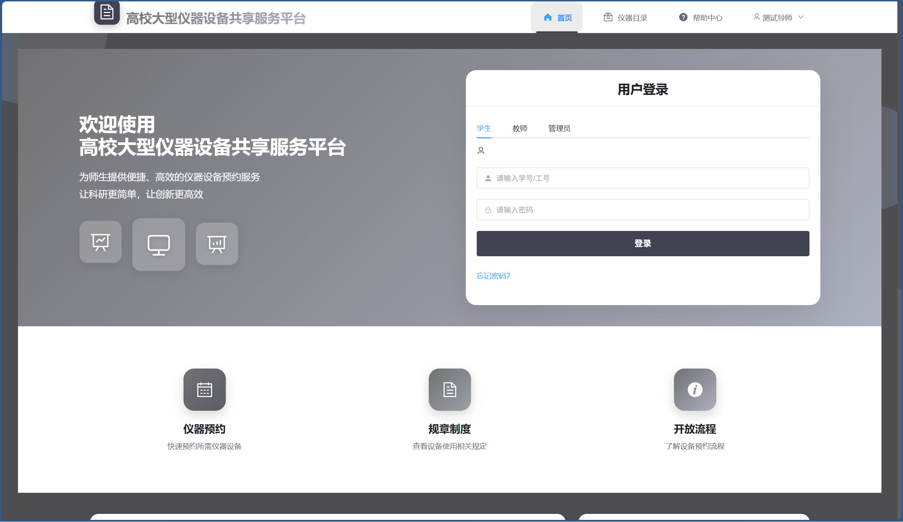
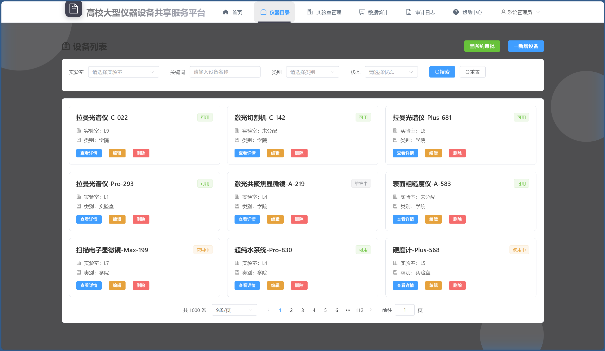
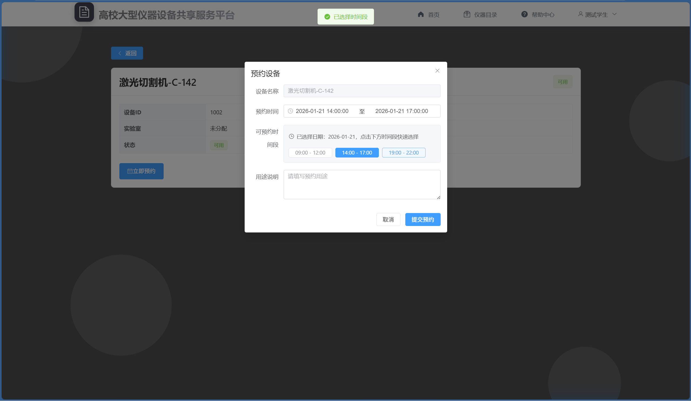
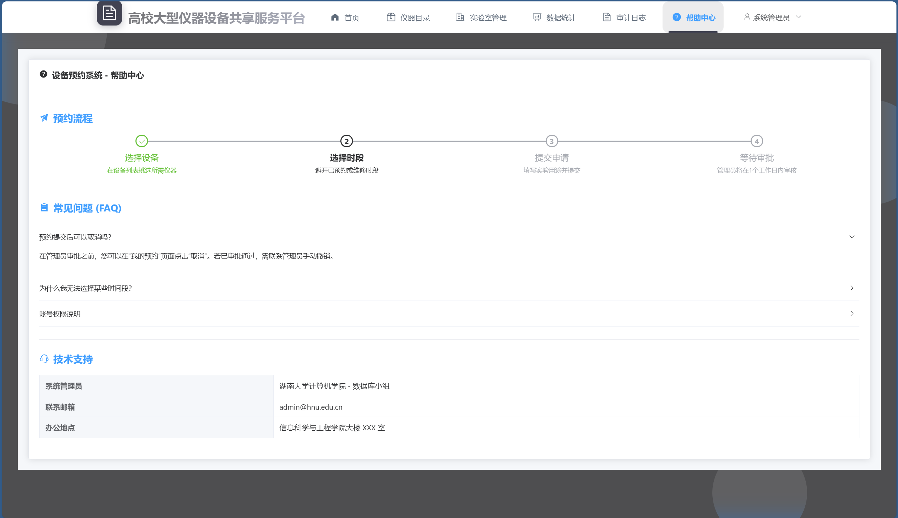
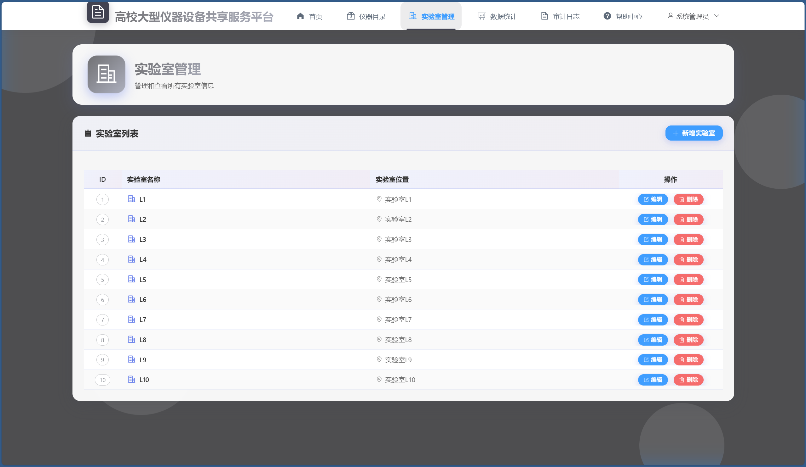
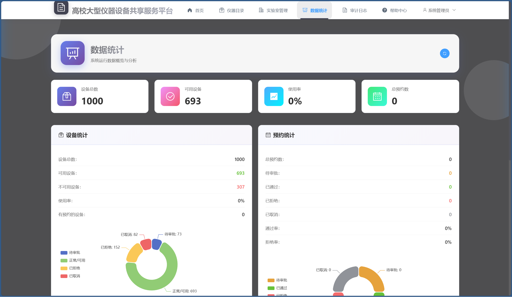
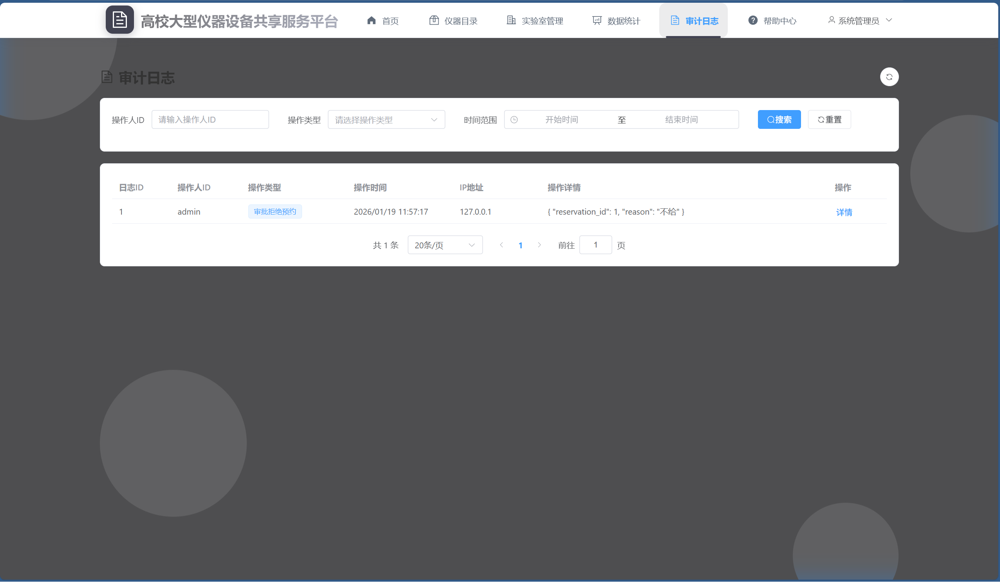

# 高校大型仪器设备共享服务平台 - 用户使用说明书

## 目录

1. [系统简介](#系统简介)
2. [快速开始](#快速开始)
3. [学生/教师使用指南](#学生教师使用指南)
4. [管理员使用指南](#管理员使用指南)
5. [常见问题](#常见问题)

---

## 系统简介

高校大型仪器设备共享服务平台是一个为高校师生提供仪器设备预约服务的在线平台。系统支持学生、教师和管理员三种角色，帮助您便捷地预约和管理实验室设备。

### 主要功能

- **设备浏览**：查看所有可用的仪器设备信息
- **在线预约**：提交设备预约申请，选择合适的时间段
- **预约管理**：查看预约状态、取消预约
- **审批管理**（管理员）：审批预约申请、管理设备信息

---

## 快速开始

### 访问系统

1. 打开浏览器，访问系统网址
2. 系统首页将显示登录界面和系统介绍

### 登录系统

1. 在首页选择您的用户类型（学生/教师/管理员）
2. 输入您的学号/工号和密码
3. 点击"登录"按钮

**测试账号**：
- 学生：学号 `2023001`，密码 `123456`
- 教师：工号 `T001`，密码 `123456`
- 管理员：ID `admin`，密码 `123456`

---

## 学生/教师使用指南

### 一、浏览设备

#### 1. 查看设备列表

登录后，点击导航栏的"设备列表"进入设备浏览页面。

**功能说明**：
- **筛选功能**：可以按实验室、设备类别、设备状态进行筛选
- **搜索功能**：在搜索框输入设备名称关键词进行搜索
- **分页浏览**：使用底部分页器浏览更多设备

#### 2. 查看设备详情

点击设备列表中的任意设备，进入设备详情页面。

**设备详情包含**：
- 设备基本信息（名称、所属实验室、状态等）
- 设备可用时间段
- 设备可用日期列表
- 预约按钮（如果设备可用）

### 二、创建预约

#### 步骤1：选择设备

在设备列表或设备详情页，找到您需要预约的设备。

#### 步骤2：填写预约信息

1. 点击"立即预约"或"新建预约"按钮
2. 在弹出的预约对话框中：
   - **选择设备**：如果未选择，从下拉列表中选择设备（支持搜索）
   - **选择预约时间**：点击时间选择器，选择开始时间和结束时间
     - ⚠️ **注意**：预约时间必须在设备的可用时间段内
   - **填写用途说明**：简要说明预约设备的用途（可选但建议填写）

#### 步骤3：提交预约

1. 确认预约信息无误后，点击"提交"按钮
2. 系统会验证预约时间是否可用
3. 提交成功后，预约状态为"待审批"，等待管理员审核

**预约规则**：
- 预约时间不能是过去的时间
- 预约时间不能与其他已通过的预约冲突
- 只能预约设备可用时间段内的时间

### 三、管理我的预约

#### 查看预约列表

1. 点击导航栏的"预约管理"
2. 在"我的预约"标签页查看所有预约记录

**功能说明**：
- **状态筛选**：可以按状态筛选（全部/待审批/已通过/已拒绝/已取消）
- **状态说明**：
  - 🟡 **待审批**：已提交，等待管理员审核
  - 🟢 **已通过**：管理员已批准，可以使用设备
  - 🔴 **已拒绝**：管理员已拒绝，可查看拒绝理由
  - ⚪ **已取消**：您已取消的预约

#### 查看预约详情

点击预约列表中的"详情"按钮，查看预约的详细信息，包括：
- 设备名称
- 预约时间
- 预约状态
- 用途说明
- 审批意见（如有）

#### 取消预约

1. 在预约列表中，找到状态为"待审批"的预约
2. 点击"取消"按钮
3. 确认取消操作

**注意**：只有"待审批"状态的预约可以取消，已通过的预约无法取消。

### 四、查看帮助信息

系统提供了丰富的帮助信息：

- **帮助中心**：点击导航栏"帮助中心"，查看常见问题和使用指南
- **流程说明**：点击"流程说明"，了解设备预约的完整流程
- **使用规则**：点击"使用规则"，查看设备使用的相关规定

---

## 管理员使用指南

管理员拥有系统的完整管理权限，包括设备管理、预约审批、数据统计等功能。

### 一、设备管理

#### 1. 查看设备列表

登录管理员账号后，可以通过"设备列表"查看所有设备。

#### 2. 添加新设备

1. 点击导航栏的"设备管理"（或在设备列表页点击"新增设备"）
2. 填写设备信息：
   - 设备名称（必填）
   - 所属实验室（可选）
   - 设备类别（院级共享/实验室专用）
   - 设备状态（正常/维修/报废）
3. 点击"提交"保存

#### 3. 编辑设备信息

1. 在设备列表中找到要编辑的设备
2. 点击"编辑"按钮
3. 修改设备信息后保存

#### 4. 删除设备

1. 在设备列表中找到要删除的设备
2. 点击"删除"按钮
3. 确认删除操作

**注意**：删除设备前，请确保没有未完成的预约记录。

### 二、时间段管理

为设备配置可用时间段是预约功能正常工作的前提。

#### 1. 创建时间段

1. 进入设备管理页面
2. 选择要配置时间段的设备
3. 点击"时间段管理"
4. 点击"新增时间段"
5. 填写时间段信息：
   - 开始时间（如：09:00）
   - 结束时间（如：12:00）
   - 是否激活（默认激活）
6. 点击"保存"

**时间段说明**：
- 时间段是每天重复的，例如设置 09:00-12:00，表示该设备每天这个时间段都可用
- 可以为同一设备配置多个时间段
- 可以通过"激活/禁用"控制时间段是否生效

#### 2. 编辑时间段

1. 在时间段列表中，找到要编辑的时间段
2. 点击"编辑"按钮
3. 修改时间段信息后保存

#### 3. 删除时间段

1. 在时间段列表中，找到要删除的时间段
2. 点击"删除"按钮
3. 确认删除操作

### 三、预约审批

#### 1. 查看待审批预约

1. 点击导航栏的"预约管理"
2. 切换到"预约审批"标签页
3. 默认显示所有"待审批"的预约

#### 2. 审批通过预约

1. 在待审批列表中，找到要审批的预约
2. 点击"通过"按钮
3. 系统会自动更新预约状态为"已通过"
4. 设备状态会更新为"使用中"

#### 3. 拒绝预约

1. 在待审批列表中，找到要拒绝的预约
2. 点击"拒绝"按钮
3. 在弹出的对话框中填写拒绝理由（可选但建议填写）
4. 点击"确认"完成拒绝操作

**审批说明**：
- 审批通过后，用户可以使用设备
- 拒绝预约时，建议填写拒绝理由，方便用户了解原因
- 所有审批操作都会被记录在审计日志中

### 四、实验室管理

#### 1. 查看实验室列表

点击导航栏的"实验室管理"，查看所有实验室信息。

#### 2. 添加实验室

1. 点击"新增实验室"按钮
2. 填写实验室信息：
   - 实验室名称（必填）
   - 实验室位置（可选）
3. 点击"保存"

#### 3. 编辑实验室

1. 在实验室列表中找到要编辑的实验室
2. 点击"编辑"按钮
3. 修改信息后保存

#### 4. 删除实验室

1. 在实验室列表中找到要删除的实验室
2. 点击"删除"按钮
3. 确认删除操作

**注意**：删除实验室前，请确保该实验室下没有关联的设备。

### 五、数据统计

系统提供了丰富的数据统计功能，帮助管理员了解系统使用情况。

1. 点击导航栏的"数据统计"进入统计页面

**统计内容**：
- **设备统计**：
  - 设备总数
  - 可用设备数
  - 设备使用率
  - 设备状态分布
  - 设备类别分布
- **预约统计**：
  - 总预约数
  - 待审批/已通过/已拒绝/已取消数量
  - 通过率和拒绝率
  - 最近30天预约趋势
- **用户统计**：
  - 学生总数
  - 教师总数
  - 管理员总数
- **热门设备**：近一周/近一月预约次数最多的设备排行

### 六、审计日志

系统自动记录管理员的所有关键操作，方便追溯和审计。

1. 点击导航栏的"审计日志"查看操作记录

**日志内容**：
- 操作人
- 操作时间
- 操作类型（创建设备、更新设备、审批预约等）
- 操作详情
- IP地址

**筛选功能**：
- 按操作人筛选
- 按操作类型筛选
- 按时间范围筛选

---

## 常见问题

### Q1: 为什么我无法预约某个设备？

**可能原因**：
1. 设备状态不是"正常"状态
2. 设备没有配置可用时间段
3. 您选择的预约时间不在设备的可用时间段内
4. 您选择的预约时间与其他预约冲突
5. 您选择的预约时间是过去的时间

**解决方法**：
- 检查设备状态和可用时间段
- 选择其他时间段或日期
- 联系管理员确认设备配置

### Q2: 预约提交后多久能知道结果？

预约提交后，状态为"待审批"，需要等待管理员审核。审核时间取决于管理员的处理速度，通常会在1-2个工作日内完成。

### Q3: 可以取消已通过的预约吗？

已通过的预约无法自行取消。如需取消，请联系管理员处理。

### Q4: 预约被拒绝后可以重新申请吗？

可以。预约被拒绝后，您可以重新提交预约申请，建议根据拒绝理由调整预约时间或联系管理员咨询。

### Q5: 如何查看设备的可用时间段？

在设备详情页面，会显示该设备的所有可用时间段。您也可以在创建预约时，系统会自动显示可用的时间段。

### Q6: 忘记密码怎么办？

请联系系统管理员重置密码。

### Q7: 管理员如何为设备配置时间段？

1. 进入设备管理页面
2. 选择要配置的设备
3. 点击"时间段管理"
4. 添加时间段（如：09:00-12:00, 14:00-17:00）
5. 确保时间段处于"激活"状态

### Q8: 设备状态有哪些？

- **正常**：设备可用，可以预约
- **维修**：设备正在维修，不可预约
- **使用中**：设备已被预约使用
- **报废**：设备已报废，不可预约

### Q9: 如何查看我的预约历史？

登录后，点击"预约管理"，在"我的预约"标签页可以查看所有历史预约记录，支持按状态筛选。

### Q10: 系统支持哪些浏览器？

建议使用以下浏览器的最新版本：
- Chrome（推荐）
- Firefox
- Edge
- Safari

---

## 联系支持

如遇到问题或需要帮助，请：

1. 查看"帮助中心"页面
2. 查看"流程说明"和"使用规则"
3. 联系系统管理员

---

## 更新日志

### v1.0.0 (2026-01-20)
- 初始版本发布
- 支持设备浏览和预约功能
- 支持预约审批功能
- 支持数据统计和审计日志

---

**祝您使用愉快！**
